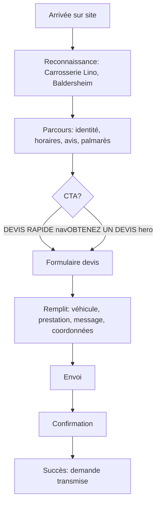
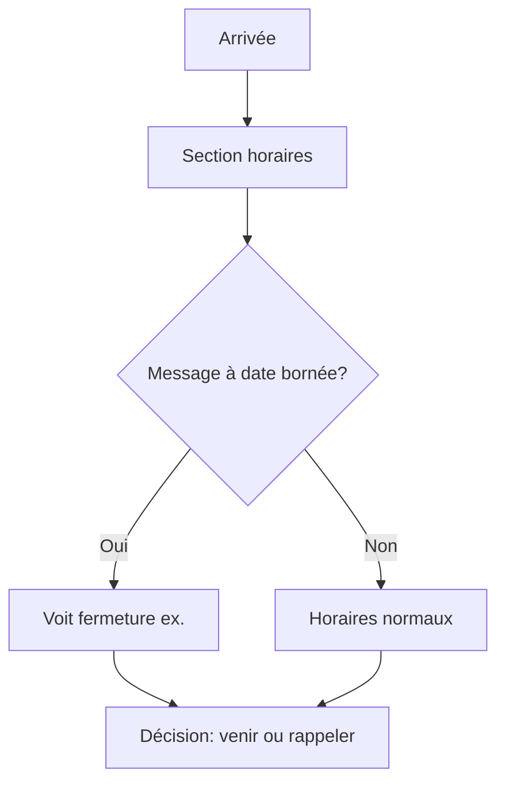
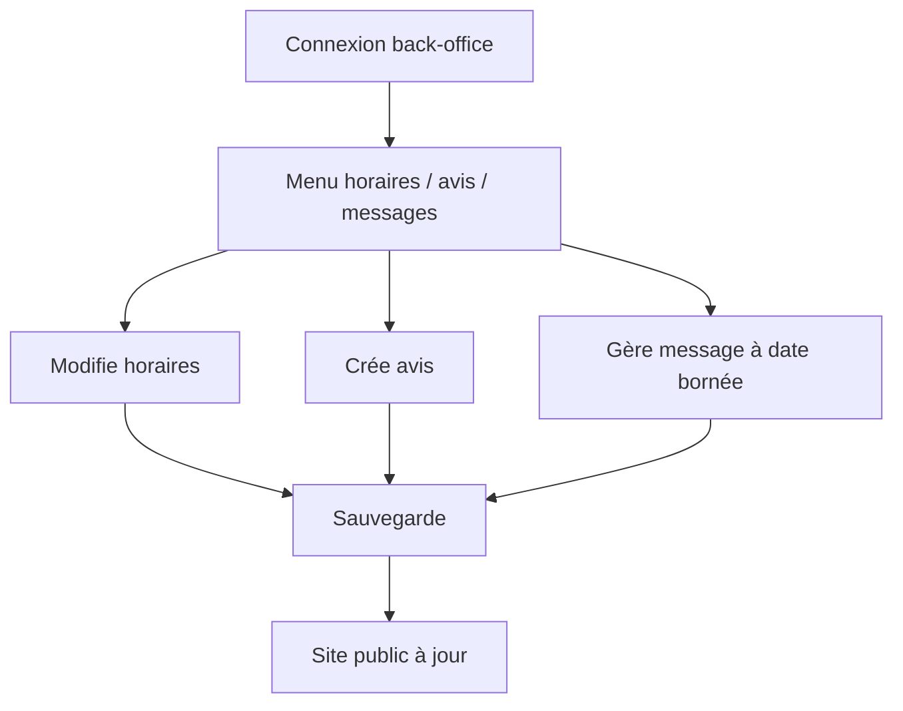

# UX Design Specification site-alexis

**Author:** Eoran
**Date:** 2026-03-11

---

## Executive Summary

### Project Vision

Refondre le site de la **Carrosserie Lino** (Baldersheim) pour qu'il porte la **nouvelle identité d'Alexis Haffner** (propriétaire depuis 2022) et qu'il soit **trouvable**, **crédible** et **contactable** pour les particuliers qui cherchent un carrossier en local. Le site actuel affiche encore l'ancien propriétaire ; l'enjeu est de donner le bon visage et la bonne vision tout en gardant la notoriété du nom Lino.

**Contrainte UX prioritaire :** Référence visuelle = une image (maquette). Rester fidèle à cette référence ; ajustements possibles avec le client le moment venu pour assurer la cohérence des autres pages.

### Target Users

- **Visiteurs (cible principale)** : Particuliers en recherche locale (ex. « carrosserie Baldersheim »). Besoin de trouver, de se rassurer (horaires, avis, identité) et de contacter ou demander un devis sans friction.
- **Alexis** : Propriétaire du garage ; met à jour horaires, avis (saisie manuelle type Google) et 2 messages à date bornée via le back-office. Autonomie sans dépendre du dev.
- **Administrateur** : Gestion globale du site, comptes et sécurité.

### Key Design Challenges

- **Référence visuelle** : Une image fournie (maquette) ; ajustements avec le client si nécessaire pour cohérence.
- **Crédibilité et confiance** : Mise en avant d'Alexis (photo, texte, ton), horaires à jour, avis clients visibles, CTA « Demander un devis » bien visible.
- **Simplicité du parcours** : Site vitrine centré sur visibilité et contact ; pas de sur-dimensionnement côté public.
- **Back-office utilisable** : Alexis doit pouvoir gérer horaires, avis et messages sans formation complexe.

### Design Opportunities

- **Identité claire** : Mise en avant d'Alexis (photo, texte, ton) pour renforcer la confiance.
- **Messages contextuels** : 2 messages à date bornée (ex. fermeture pour congés) bien placés pour informer sans encombrer.
- **i18n dès le départ** : Structure multilingue (FR prioritaire, DE possible) intégrée dès le MVP.

---

## Core User Experience

### Defining Experience

**Action centrale du visiteur :** Trouver le garage, se rassurer (identité, horaires, avis) et contacter ou demander un devis. Le site vitrine est conçu pour cette boucle : visibilité → crédibilité → contact.

**Priorité des pages (MVP) :** L'**index (page d'accueil)** est la priorité immédiate — elle concentre l'essentiel (identité, horaires, avis, CTA devis). Les autres pages seront détaillées après validation du plan prévisionnel par le client, ce qui permettra d'assurer la cohérence globale.

### Platform Strategy

- **Web** : Site responsive, consultation sur mobile et desktop (recherche locale souvent mobile).
- **Touch et clavier** : CTA et formulaires accessibles au doigt et à la souris.
- **Pas d'offline** : Site vitrine, pas de PWA requise en v1.

### Effortless Interactions

- **Reconnaissance immédiate** : Logo, nom Carrosserie Lino, localisation Baldersheim visibles dès l'arrivée.
- **Contact sans friction** : Bouton « Demander un devis » visible, formulaire simple ; numéro de téléphone facile à trouver.
- **Vérification des horaires** : Section horaires claire ; messages à date bornée (fermeture) bien placés pour éviter les déplacements inutiles.

### Critical Success Moments

- **« C'est le bon garage »** : Le visiteur identifie Carrosserie Lino et Alexis en quelques secondes.
- **« Je peux les joindre »** : Le CTA devis et le téléphone sont évidents.
- **« Les infos sont à jour »** : Horaires et messages de fermeture inspirent confiance.

### Experience Principles

1. **Référence visuelle** — Respecter l'image fournie ; ajuster avec le client si nécessaire pour cohérence.
2. **Index d'abord** — Page d'accueil prioritaire ; plan prévisionnel des autres pages à valider après index.
3. **Crédibilité immédiate** — Identité Alexis, horaires, avis visibles sans scroll excessif.
4. **Contact sans effort** — CTA devis et téléphone accessibles en un clic.
5. **Back-office simple** — Alexis gère horaires, avis et messages sans formation complexe.

### Hiérarchie visuelle (above the fold)

- Logo + nom Carrosserie Lino en tête.
- CTA « Demander un devis » visible sans scroll.
- Horaires et avis dans la zone visible.
- Messages à date bornée : bannière ou encart bien placé, visible sans nuire à la lisibilité.

### Structure des avis (back-office)

- Champs : texte, auteur, note, date — format cohérent pour affichage et saisie.

---

## Plan prévisionnel du site (à valider après index)

Plan des pages et éléments visibles sur la maquette, à soumettre au client pour validation après livraison de l'index.

### Navigation principale (maquette)

| Lien | Description | Type |
|------|-------------|------|
| **ACCUEIL** | Page d'accueil | Index |
| **NOS SERVICES** | Liste de tous les services | Page dédiée |
| **GALERIE** | Galerie photos des réalisations | Page dédiée |
| **AVIS CLIENTS** | Avis clients (section étendue ou page) | Page ou section |
| **DEVIS RAPIDE** | Formulaire de demande de devis | Page / modal |

### Sections index (structure maquette)

- **Barre contact** : Localisation (Baldersheim), Téléphone, Horaires
- **Hero** : « EXPÉRIMENTÉS & PROFESSIONNELS », « CARROSSERIE & RÉPARATION AUTO », « À VOTRE SERVICE DEPUIS 2007 », CTA OBTENEZ UN DEVIS
- **3 cartes services rapides** : Réparation carrosserie, Remplacement pare-brise, Entretien & mécanique (liens vers pages services ?)
- **QUI SOMMES-NOUS** : Texte, photo garage, bouton **EN SAVOIR PLUS** → page À propos
- **NOS SERVICES** : 4 cartes avec images — Réparation & Peinture, Débosselage, Pare-brise & Vitrages, Véhicules de courtoisie
- **DÉCOUVRIR TOUS NOS SERVICES** → page Services
- **Témoignage** : « Travail toujours impeccable, on peut avoir confiance ! » — Pierre M.

### Footer (maquette)

| Élément | Lien potentiel |
|--------|----------------|
| **ASSURANCE & EXPERTISES** | Page ou section dédiée |
| **VÉHICULES TOUTES MARQUES** | Page ou section (marques prises en charge) |
| **PRÊT DE VOITURE** | Véhicules de courtoisie — page ou section |
| **Facebook, Instagram** | Liens externes réseaux sociaux |
| **Mentions légales** | Page légale |

### Pages à prévoir (extrait de la maquette)

| Page | Source maquette | Priorité |
|------|-----------------|----------|
| **Index** | ACCUEIL, structure complète | MVP (priorité 1) |
| **Demande de devis** | DEVIS RAPIDE, OBTENEZ UN DEVIS | MVP |
| **Nos Services** | NOS SERVICES, DÉCOUVRIR TOUS NOS SERVICES | Post-index |
| **Galerie** | GALERIE (nav) | Post-index |
| **Avis clients** | AVIS CLIENTS (nav) | Post-index |
| **Qui sommes-nous** | EN SAVOIR PLUS | Post-index |
| **Pages services détaillées** | 4 cartes (Réparation & Peinture, Débosselage, Pare-brise & Vitrages, Véhicules de courtoisie) | Post-index |
| **Assurance & expertises** | Footer | À valider client |
| **Véhicules toutes marques** | Footer | À valider client |
| **Prêt de voiture** | Footer (véhicules de courtoisie) | À valider client |
| **Mentions légales** | Footer | MVP |

*Les éléments footer (Assurance, Toutes marques, Prêt de voiture) peuvent être des pages, des sections ou des ancres — à préciser avec le client.*

---

## Desired Emotional Response

### Primary Emotional Goals

- **Rassurant** — Le visiteur doit se sentir en confiance : son véhicule sera entre de bonnes mains.
- **Pro** — Expertise reconnue : Alexis Haffner, **3ᵉ aux championnats du monde de carrosserie 2018 (Brésil)** — pas le péquin moyen. Petit garage, niveau mondial.
- **Proximité humaine** — Accessible, à l'écoute, proche de Baldersheim ; pas une chaîne impersonnelle.

**Positionnement émotionnel :** « Expert de niveau mondial à portée de main » — le meilleur des deux mondes : l'excellence technique sans la froideur.

### Emotional Journey Mapping

**À l'arrivée :** Reconnaissance immédiate (Carrosserie Lino, Baldersheim) — « C'est le bon endroit ».  
**Pendant la découverte :** Confiance qui monte (identité Alexis, palmarès, avis, horaires) — « Je peux leur faire confiance ».  
**Après contact / devis :** Soulagement, sentiment d'avoir pris la bonne décision — « J'ai bien fait de les contacter ».  
**Retour :** Cohérence, site à jour — « Les infos sont fiables ».

### Micro-Emotions

| Viser | Éviter |
|-------|--------|
| Confiance | Confusion ou scepticisme |
| Légère fierté (« j'ai trouvé un expert ») | Anxiété (« est-ce que c'est sérieux ? ») |
| Proximité, accessibilité | Impression de chaîne ou d'usine |

### Design Implications

- **Mise en avant du palmarès** : « 3ᵉ mondial 2018 » visible (hero, Qui sommes-nous, ou section dédiée) — crédibilité immédiate sans surcharge.
- **Photo et ton d'Alexis** : Humain, souriant, accessible — équilibre pro / proximité.
- **Avis clients** : Témoignages concrets (« Travail toujours impeccable ») pour renforcer la confiance.
- **Ton et vocabulaire** : Professionnel mais chaleureux, pas corporate, pas trop technique.
- **Cohérence** : Petit garage assumé, avec une expertise qui détonne — pas de prétention, juste les faits.

### Emotional Design Principles

1. **Expert de confiance** — Le palmarès mondial renforce la crédibilité sans écraser.
2. **Proximité assumée** — Petit garage, équipe à l'écoute, pas de distance.
3. **Rassurance par les preuves** — Avis, horaires, identité claire.
4. **Pas de survente** — Les faits parlent (palmarès, 2007, avis) ; pas de promesses vides.

---

## UX Pattern Analysis & Inspiration

### Inspiring Products Analysis

**Référence principale : maquette fournie** — Layout épuré, bleu/blanc, structure claire. Barre contact (localisation, téléphone, horaires) en tête ; hero avec CTA ; cartes services ; section Qui sommes-nous ; témoignage ; footer structuré.

**Contexte projet :** Site vitrine carrosserie locale, objectifs rassurance / pro / proximité, palmarès mondial Alexis. Pas de recherche d’inspirations externes — la maquette et le contexte déjà décrit suffisent.

### Transferable UX Patterns

| Pattern | Source | Application |
|--------|--------|-------------|
| **Barre contact above the fold** | Maquette | Localisation, téléphone, horaires visibles immédiatement |
| **CTA devis en double** | Maquette (header + hero) | DEVIS RAPIDE (nav) + OBTENEZ UN DEVIS (hero) — accès rapide |
| **Cartes services en grille** | Maquette | 3 cartes rapides + 4 cartes détaillées — hiérarchie claire |
| **Section identité + CTA** | Maquette (Qui sommes-nous) | Texte, photo garage, EN SAVOIR PLUS — crédibilité + approfondissement |
| **Témoignage** | Maquette | Citation + attribution — preuve sociale |
| **Footer thématique** | Maquette | Assurance, Toutes marques, Prêt de voiture — réponses aux questions fréquentes |

### Anti-Patterns to Avoid

- **Surcharge visuelle** — Rester fidèle à la maquette ; pas d’ajouts superflus.
- **CTA noyés** — Garder les boutons devis bien visibles (bleu, contrasté).
- **Informations essentielles cachées** — Horaires et contact toujours accessibles.
- **Ton corporate** — Éviter le jargon ; rester pro et chaleureux.
- **Palmarès sur-exploité** — Le mentionner sans en faire trop ; les faits suffisent.

### Design Inspiration Strategy

**À adopter :** Structure maquette (barre contact, hero, cartes, Qui sommes-nous, témoignage, footer) ; double CTA devis ; palette bleu/blanc ; hiérarchie claire.

**À adapter :** Intégrer le palmarès mondial (3ᵉ 2018) dans la maquette existante — hero, Qui sommes-nous ou encart dédié ; photo et identité Alexis.

**À éviter :** Éléments visuels ou textuels qui s’éloignent de la maquette ; surcharge ; ton froid ou trop corporate.

---

## Design System Foundation

### Design System Choice

**Bootstrap** — Base de composants et grille ; fidélité à la maquette via customisation et assets.

### Rationale for Selection

- **Bootstrap** : grille, composants, utilitaires, responsive ; intégration facile avec Symfony (Twig).
- **Fidélité à la maquette** : palette bleu/blanc, typographie, espacements — thème custom sur Bootstrap.
- **Assets si nécessaire** : CSS custom, images, icônes, logo pour coller à la maquette.

### Implementation Approach

- Utiliser Bootstrap (grille, composants, utilitaires, responsive).
- Surcharger les variables (couleurs, typo, espacements) pour correspondre à la maquette.
- Créer des assets CSS/JS custom si besoin pour écarts spécifiques.

### Customization Strategy

- **Variables Bootstrap** : `--bs-primary`, `--bs-body-font`, etc. pour aligner sur la maquette.
- **Assets custom** : fichiers CSS additionnels, images (hero, logo, photos), icônes si nécessaire.
- **Composants** : réutiliser Bootstrap (navbar, cards, buttons, footer) et personnaliser les styles.

---

## Defining Core Experience

### Defining Experience

**Interaction centrale :** « Demander un devis » — le visiteur trouve Carrosserie Lino, se rassure (identité, horaires, avis, palmarès) et envoie sa demande. C'est l'action qui convertit.

**Formule :** « Je trouve le garage, je vois que c'est sérieux, je demande un devis en un clic. »

### User Mental Model

- **Problème actuel :** Chercher un carrossier → comparer (Google, avis, horaires) → appeler ou remplir un formulaire.
- **Attente :** Site clair, infos à jour, contact évident (téléphone ou formulaire).
- **Risque de confusion :** CTA noyé, formulaire trop long, horaires introuvables.

### Success Criteria

- **« Ça marche »** : CTA devis visible, formulaire simple, envoi confirmé.
- **« J'ai bien fait »** : Confiance établie avant le clic (identité, avis, palmarès).
- **Feedback :** Message de confirmation après envoi ; numéro de téléphone visible en secours.

### Novel UX Patterns

**Patterns établis** : Formulaire devis classique, CTA visible, barre contact. Pas d'innovation disruptive — exécution soignée sur des patterns connus.

**Particularité** : Double CTA (header + hero) pour maximiser la visibilité ; palmarès mondial comme preuve de crédibilité.

### Experience Mechanics

| Phase | Action |
|-------|--------|
| **Initiation** | CTA « DEVIS RAPIDE » (nav) ou « OBTENEZ UN DEVIS » (hero) — visible above the fold |
| **Interaction** | Formulaire : véhicule, type de prestation, message, coordonnées — champs essentiels uniquement |
| **Feedback** | Validation en temps réel ; message de confirmation après envoi |
| **Completion** | « Votre demande a bien été envoyée » ; option d'appel si besoin |

---

## Visual Design Foundation

### Color System

**Source : maquette** — Palette bleu et blanc, ton professionnel et rassurant.

- **Primary** : Bleu (boutons CTA, liens, accents) — à extraire précisément de la maquette pour variables Bootstrap.
- **Background** : Blanc dominant ; bleu en fond pour sections (hero, footer).
- **Texte** : Noir/gris foncé sur fond clair ; blanc sur fond bleu.
- **Mapping sémantique** : primary = CTA, liens ; success/confirmation si besoin ; contrastes WCAG AA.

### Typography System

- **Ton** : Pro, lisible, accessible.
- **Hiérarchie** : Titres (hero, sections), sous-titres, corps de texte.
- **Échelle** : h1 (hero), h2 (sections), h3 (cartes), body — à aligner sur la maquette.
- **Accessibilité** : Tailles lisibles (min 16px body), contrastes suffisants.

### Spacing & Layout Foundation

- **Grille** : Bootstrap (12 colonnes) — fidèle à la maquette.
- **Espacement** : Cohérent entre sections ; aération suffisante pour lisibilité.
- **Layout** : Barre contact, hero, cartes en grille, sections alternées, footer — structure maquette.

### Accessibility Considerations

- Contrastes texte/fond conformes WCAG AA.
- CTA et liens bien identifiables (focus visible).
- Tailles de police et zones cliquables adaptées au tactile.

### Design Tokens — Extraction maquette

**Source :** `Maquette/maquette.png` — `python Maquette/extract-colors.py`

**Résultats extraction (light mode) :**

| Token | Usage | Valeur | Note |
|-------|-------|--------|------|
| **bg-light** | Fonds clairs, cartes | `#f5f5fa`, `#f6f6fb`, `#f4f4f9` | Tons bleutés très légers |
| **bg-white** | Fond principal | `#fefefe`, `#fdfefe` | Blanc cassé |
| **primary** | Boutons CTA | À extraire manuellement (zones boutons) | Gradient light blue sur maquette |
| **primary-dark** | Barre contact, footer | À extraire manuellement | Bleu navy |

*Note :* L'extraction automatique a surtout capté les fonds clairs. Les bleus saturés (boutons, barre, footer) nécessitent un color picker sur les zones concernées ou un échantillonnage ciblé.

**Boutons CTA :** Light blue gradient, coins arrondis, texte blanc.

---

### Dark Mode (prévu, hors maquette actuelle)

**Statut :** Non présent dans la maquette ; à prévoir en implémentation.

**Principes :**
- Inverser ou adapter les tokens : fond sombre, texte clair.
- Conserver la hiérarchie (primary, primary-dark) avec des équivalents dark.
- Prévoir `prefers-color-scheme: dark` et/ou toggle manuel.
- Vérifier contrastes WCAG AA en mode sombre.

**Tokens à définir :**
- `--bs-body-bg` (dark)
- `--bs-body-color` (dark)
- `--bs-primary` (dark) — CTA restant visible
- Bordures, cartes, footer — palettes inversées ou adaptées

**Détail :** À préciser en phase d'implémentation (Bootstrap 5 dark mode, variables CSS, ou thème custom).

---

## Design Direction Decision

### Design Directions Explored

**Direction unique : maquette fidèle** — Pas de variations explorées ; la maquette fournie est la référence visuelle. Bootstrap + assets custom pour coller au layout, palette et composants.

### Chosen Direction

**Maquette Carrosserie Lino** — Structure : barre contact (bleu navy), nav blanche, hero image + CTA, cartes services, Qui sommes-nous, grille services, témoignage, footer bleu navy.

### Design Rationale

- Fidélité explicite au client ; pas de divergence visuelle.
- Palette bleu/blanc, CTA light blue, hiérarchie claire.
- Ajouts prévus : palmarès mondial Alexis, dark mode (hors maquette).

### Implementation Approach

- Bootstrap (grille, composants) + thème custom.
- Tokens extraits (`#f5f5fa`, etc.) + extraction manuelle des bleus saturés.
- Structure HTML/CSS alignée sur la maquette ; responsive.

---

## User Journey Flows

### Visiteur — Demander un devis

### Visiteur — Vérifier horaires / fermeture

### Alexis — Mise à jour contenu (back-office)

### Journey Patterns

- **Navigation** : Barre contact + nav + CTA toujours accessibles.
- **Décision** : CTA devis visible, formulaire simple, pas de friction.
- **Feedback** : Confirmation après envoi ; messages à date bornée visibles.

### Flow Optimization Principles

- **Minimiser les étapes** : CTA above the fold ; formulaire court.
- **Feedback clair** : Confirmation devis ; horaires et messages à jour.
- **Erreur** : Validation formulaire ; message d'erreur explicite.

---

## Component Strategy

### Bootstrap (fondation)

- Navbar, cards, buttons, forms, footer, grid, utilities.

### Composants custom / adaptations

| Composant | Usage | Source |
|-----------|-------|--------|
| **Barre contact** | Localisation, téléphone, horaires | Maquette — barre bleu navy |
| **Hero** | Image + texte + CTA | Maquette — overlay sur image |
| **Carte service** | Icône, titre, description | Bootstrap card + style maquette |
| **Section Qui sommes-nous** | 2 colonnes texte + image | Bootstrap row/col |
| **Grille services** | 4 images avec overlay | Bootstrap grid + overlay |
| **Témoignage** | Citation + attribution | Section dédiée |
| **Formulaire devis** | Champs essentiels | Bootstrap form + validation |

### Stratégie

- Réutiliser Bootstrap au maximum ; surcharger les styles pour coller à la maquette.
- Assets custom si besoin (icônes, images).

---

## UX Consistency Patterns

### Boutons

- **Primary** : CTA devis (bleu gradient, texte blanc).
- **Secondary** : EN SAVOIR PLUS, liens.
- **Hiérarchie** : Un CTA principal par section.

### Feedback

- **Succès** : Confirmation envoi devis.
- **Erreur** : Validation formulaire, message explicite.
- **Info** : Messages à date bornée (fermeture).

### Formulaires

- Champs essentiels ; validation en temps réel ; labels clairs.

### Navigation

- Barre contact fixe ; nav avec liens + CTA ; footer avec liens.

---

## Responsive & Accessibility

### Responsive

- **Mobile-first** : Bootstrap breakpoints (sm, md, lg, xl).
- **Mobile** : Nav hamburger ; cartes en colonne ; CTA visible.
- **Tablet/Desktop** : Layout maquette ; grille 3/4 colonnes.

### Breakpoints

- Mobile : < 768px
- Tablet : 768px — 991px
- Desktop : ≥ 992px

### Accessibilité

- **WCAG AA** : Contrastes, tailles, focus visible.
- **Clavier** : Navigation complète ; focus sur CTA et liens.
- **Tactile** : Zones cliquables ≥ 44px. message d’erreur explicite.
